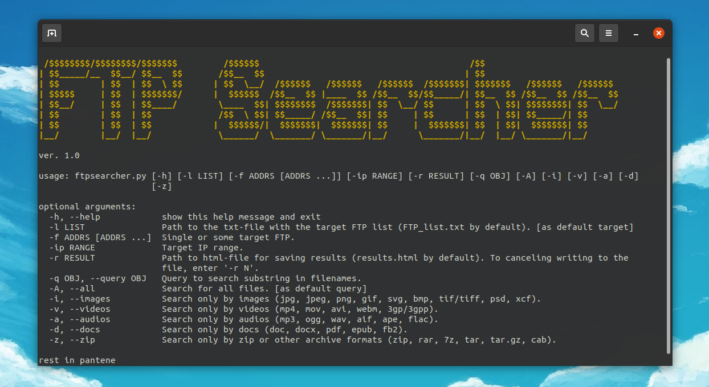

FTP Searcher
=========


**FTP Searcher** is an asynchronous file scanner from FTP servers list/IP range by query or filetype with recording the results to a file as a set of links.



Features
--------
Unlike other existing FTP-search engines that use threading, it uses asyncio as concurrency implementation because it's better suited for tasks that can implies slow I/O bound and multiple/unlimited quantity of connections. Also, there used a four types of requests: MLSD/LIST (aioftp) in the main and MLSD/NLST (ftplib) as a reserve method for some servers.

Attention: aioftp lib don't recognize Cyrillic symbols and skip files with them in their names; therefore, in some situations you can prefer to use only the synchronous mode [soon].

Installation
--------

```
git clone https://github.com/Sunlight-Rim/FTPSearcher.git
cd FTPSearcher
pip3 install -r requirements.txt
python3 ftpsearcher.py
```

Usage
--------

```
ftpsearcher.py [-h] [-l LIST] [-f ADDRS [ADDRS ...]] [-ip RANGE] [-r RESULT] [-q OBJ] [-A] [-i] [-v] [-a] [-d] [-z]

optional arguments:
  -h, --help            show this help message and exit
  -l LIST               Path to the txt-file with the target FTP list (FTP_list.txt by default). [as default target]
  -f ADDRS [ADDRS ...]  Single or some target FTP.
  -ip RANGE             Target IP range.
  -r RESULT             Path to html-file for saving results (results.html by default). To canceling writing to the file, enter
                        '-r N'.
  -q OBJ, --query OBJ   Query to search substring in filenames.
  -A, --all             Search all files. [as default query]
  -i, --images          Search only by images (jpg, jpeg, png, gif, svg, bmp, tif/tiff, psd, xcf).
  -v, --videos          Search only by videos (mp4, mov, avi, webm, 3gp/3gpp).
  -a, --audios          Search only by audios (mp3, ogg, wav, aif, ape, flac).
  -d, --docs            Search only by docs (doc, docx, pdf, epub, fb2).
  -z, --zip             Search only by zip or other archive formats (zip, rar, 7z, tar, tar.gz, cab).

rest in pantene
```

The result file is overwritten each time you start the search, unless you specify a file different from the previous one or use '-r N' flag.

Examples
--------
Scan single FTP for images and don't write results into a file.
```
python3 ftpsearcher.py -f exampleftp.org -r N -i
```

Scan FTP from /home/rim/target_place.txt and write results to results_place.html located in the program folder.
```
python3 ftpsearcher.py -l /home/rim/target_place.txt -r results_place.html
```

Search a range of 254 addresses by query.
```
python3 ftpsearcher.py -ip 127.0.0.0-127.0.0.255 -q fairytales.pdf
```

Scan FTP from FTP_list.txt and write results to results.html.
```
python3 ftpsearcher.py
```


--------

Current Release: ver. 1.0 (2020.12.03)
