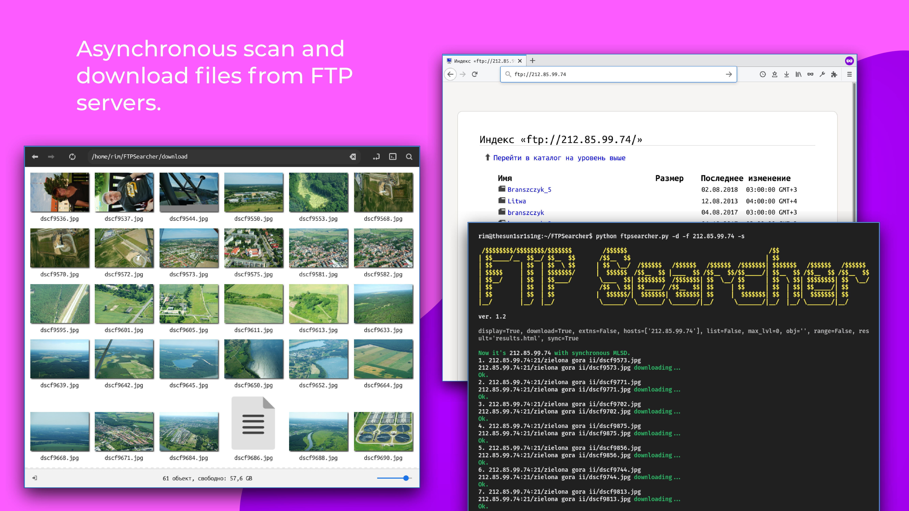

FTP Searcher
=========


**FTP Searcher** is an asynchronous file scanner and crawler for FTP servers. It also can search by queries and at given max folder-tree level.



Features
--------
Unlike other existing FTP crawlers and scanners that use threading, it uses asynchronous as the main concurrency implementation because it's better suited for tasks that can implies slow I/O bound and multiple/unlimited quantity of connections. Moreover, there used a four types of requests: MLSD/LIST (asynchronous asyncio and aioftp) in the main and MLSD/NLST (ftplib with multithreading) as a reserve method for some servers. It also runs on Termux.

Installation
--------
Install [Python 3](https://www.python.org/downloads/) and [git](https://git-scm.com/downloads).

```
git clone https://github.com/Sunlight-Rim/FTPSearcher.git
cd FTPSearcher
pip3 install -r requirements.txt
```

Usage
--------

```
ftpsearcher.py [-h] [-l LIST] [-f HOSTS [HOSTS ...]] [-ip RANGE] [-r RESULT] [-d] [-lvl MAX_LVL] [-nd] [-s] [-A] [-q OBJ [OBJ ...]] [-img] [-vid] [-aud] [-doc] [-zip]

optional arguments:
  -h, --help            show this help message and exit
  -l LIST               Path to txt file with FTP target list in form 'host:port' (ftplist.txt by default).
  -f HOSTS [HOSTS ...]  Single or some target FTP with the input data as 'host:port'.
  -ip RANGE             Target IP range as 'start-end:port'.
  -r RESULT             Path to html-file for saving results (results.html by default). Enter '-r N' to cancel.
  -d, --download        Automatically downloads all the found files to the /downloads/ folder.
  -lvl MAX_LVL          Set up the maximum file tree level on FTP servers.
  -nd, --nodisplay      Do not display servers that are not responding in the terminal log.
  -s, --sync            Use only synchronous requests.

  -A, --all             Search all files.
  -q OBJ [OBJ ...]      Queries to search substrings into filenames.
  -img, --images        Search only by images (jpg, jpeg, png, gif, svg, bmp, tif/tiff, psd, xcf).
  -vid, --videos        Search only by videos (mp4, mov, avi, webm, 3gp/3gpp).
  -aud, --audios        Search only by audios (mp3, ogg, wav, aif, ape, flac).
  -doc, --docs          Search only by docs (doc, docx, pdf, epub, fb2).
  -zip, --archives      Search only by archives (zip, rar, 7z, tar, tar.gz, cab).

rest in pantene
```

If you don't explicitly specify the port, port 21 will be used by default.\
Attention: some poorly configured FTP can't be used with concurrency methods or aioftp doesn't work with them; therefore, in such situations you can prefer to use only synchronous mode (flag '-s').

Examples
--------

Just scan all files on FTP from ftplist.txt and write the results to results.html.
```
python3 ftpsearcher.py
```

Download files by query on single FTP and don't write the results into a file.
```
python3 ftpsearcher.py -f fairytales.org -q andersen.pdf -d -r N
```

Scan files on a range of 255 addresses, with port 20, by two queries, don't write the results into a file and set 3 as the max tree level.
```
python3 ftpsearcher.py -ip 127.0.0.0-127.0.0.255:20 -q petrichor.epub thunderstorm.jpg -r N -lvl 3
```

Search images on FTP list in /home/rim/targets-example.txt and record the results to res-example.html located in the program folder.
```
python3 ftpsearcher.py -l /home/rim/targets-example.txt -img -r res-example.html
```


--------

Current Release: ver. 1.2 (2021.02.03)
